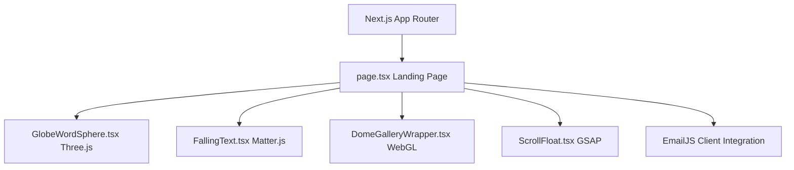

# PromoPartners: Technical Project Overview

Welcome to **PromoPartners®**, a premium, high-end editorial digital marketing agency landing page. This project represents a modern, visually stunning showcase of immersive 3D graphics, advanced physics simulations, and cinematic scroll interactions, all designed to deliver a luxury brand aesthetic.

---

## 1. Core Architecture & Tech Stack

The application is built on top of **Next.js 16 (App Router)** and **React 19**, designed to maximize performance, visual fidelity, and SEO indexing.



### Key Libraries & Runtimes:
* **Interactive 3D Engine:** [Three.js](https://threejs.org/) & CSS2DRenderer for rendering distance-responsive HTML elements on a spatial 3D canvas.
* **Physics Engine:** [Matter.js](https://brm.io/matter-js/) for real-time 2D rigid body letter-dropping gravity simulations.
* **Animation & Tweens:** [GSAP (GreenSock Animation Platform)](https://gsap.com/) & GSAP ScrollTrigger for hardware-accelerated scroll-linked animations and dynamic numeric tweens.
* **Styling System:** Custom Vanilla CSS3 custom properties (CSS variables) to support high-performance rendering without Tailwind CSS overhead.

---

## 2. Directory Structure Mapping

```text
h:/pp/
├── src/
│   ├── app/
│   │   ├── globals.css           # Core premium design tokens and FAQ/Nav layouts
│   │   ├── page.tsx              # Main Landing Page entrypoint & layout container
│   │   └── careers/
│   │       └── page.tsx          # Dedicated brand careers & team onboarding page
│   ├── components/
│   │   ├── GlobeWordSphere.tsx   # Three.js 3D lattice word-sphere & lighting tracking
│   │   ├── FallingText.tsx       # Matter.js letter drop & mouse drag container
│   │   ├── DomeGallery.js        # WebGL-based curved spatial image slider
│   │   ├── DomeGalleryWrapper.tsx# Wrapper keeping WebGL instances in sync with React
│   │   ├── ScrollFloat.tsx       # GSAP-based letter-splitting scroll scroll trigger
│   │   └── TextType.tsx          # Sleek modern looped typewriter effect
│   └── types/
│       └── matter-js.d.ts        # Custom type declarations for physics models
├── public/                       # Static brand logos & background SVGs
├── sitemap.xml                   # SEO search indexing map
└── package.json                  # Dependencies configuration
```

---

## 3. High-End Visual Features

### 3.1. Three.js Connected 3D Globe (`GlobeWordSphere.tsx`)
Renders a glowing 3D spherical constellation of core brand focus keywords distributed uniformly using a **Fibonacci lattice algorithm**.
* **3D Geometry Lines:** Renders delicate connection paths (`BufferGeometry`) linking corresponding terms in space.
* **Point-Light Interaction:** A custom point light source tracks the user's cursor dynamically, casting professional depth shadows and highlights onto the sphere.
* **Depth-Correct Labels:** Utilizing `CSS2DRenderer`, floating text labels scale down, fade, and rotate based on their Z-index distance from the viewport.
* **Fluid Physics Controls:** Drag-to-rotate, inertia deceleration on release, and scroll-to-zoom controls.

### 3.2. Matter.js Physics Sandbox (`FallingText.tsx`)
A highly engaging call-to-action banner where individual characters of "READY TO ELEVATE?" physicalize, fall, and settle under custom gravity forces.
* **Wall & Ground Collisions:** Invisible Matter.js boundary blocks constrain the text inside the layout section.
* **Interactive Mouse Constraint:** Users can click, grab, flick, and toss individual letters in real-time, with adjustable drag stiffness (`stiffness: 0.2`).
* **Clean Fall Reset:** Automatically cleans up physics engines and resets character alignments after a standard timeout.

### 3.3. WebGL Dome Gallery (`DomeGallery.js`)
An immersive, curved horizontal carousel that renders portfolio campaign cards along an inner cylinder surface.
* Includes dynamic mouse/touch dragging with custom inertia scroll decay.
* Uses canvas rendering to apply perspective distortion, creating the feel of looking around a panoramic physical showroom.

### 3.4. GSAP Editorial Typography (`ScrollFloat.tsx`)
Splits large text blocks into individual characters and uses GSAP ScrollTrigger to orchestrate complex entering animations (scaling, translation, and rotation origins) on user scroll.

---

## 4. Architectural Stability & Performance Milestones

Recent core refactoring has established strict performance boundaries, resulting in **zero console warnings, zero layout shifts, and clean component lifecycles**:

### 4.1. React Hook Safety Refactoring
* **The Bug:** Accordion list items dynamically called `useState` hooks inside map functions, violating React's "Rules of Hooks" and causing rendering crashes.
* **The Fix:** Migrated all accordion toggles to a centralized `activeFaqIdx` parent state in `page.tsx` that seamlessly synchronizes list items.

### 4.2. Resolution of State Recursion ("Maximum Update Depth Exceeded")
* **The Bug:** Custom synchronous animation frames updating state keys continuously inside an `IntersectionObserver` callback caused infinite re-render loop errors.
* **The Fix:** Refactored Stats and Results count-up animations to utilize your existing **GSAP Engine** directly. Values are grouped and animated inside a single asynchronous tween per frame (`onUpdate`), eliminating state update conflicts.

### 4.3. Prop Reference Stability
* **The Bug:** Passing inline object literals and arrays (`options={{...}}`, `highlightWords={['ELEVATE']}`) in Next.js JSX forced React to recreate memory references on every single render. This caused sub-components (Three.js and Matter.js engines) to constantly recreate canvases, resulting in severe CPU spikes and memory leaks.
* **The Fix:** Extracted all literal props to **static module-level constants** (`DOME_GALLERY_OPTIONS`, `FALLING_TEXT_HIGHLIGHT`, `TEXT_TYPE_WORDS`), guaranteeing absolute reference stability.

---

## 5. Visual Preview: Completed Redesign

The Frequently Asked Questions section has been redesigned to align with a luxury editorial aesthetic, verified via local headless browser testing:


---

## 6. Guidelines for Future Development

When modifying or expanding components in this codebase, adhere strictly to the following rules:

> [!IMPORTANT]
> **1. Maintain Reference Stability**
> Never pass raw objects `{{...}}` or arrays `{[...]}` directly to complex components like `FallingText`, `DomeGalleryWrapper`, or `GlobeWordSphere`. Always declare them outside the main functional components or wrap them in `useMemo`.

> [!TIP]
> **2. Reuse the GSAP Ticker**
> For high-performance numerical animations (such as counts, scores, or loaders), do not build manual intervals. Reuse the existing GSAP engine `gsap.to(obj, { value, onUpdate: ... })` which guarantees hardware acceleration and frame batching.

> [!WARNING]
> **3. Cleanup Observers and Renders**
> Always return clean-up functions in your `useEffect` hooks to disconnect `IntersectionObserver` instances, cancel GSAP tweens, and destroy Matter.js worlds to prevent serious browser thread memory leaks.
